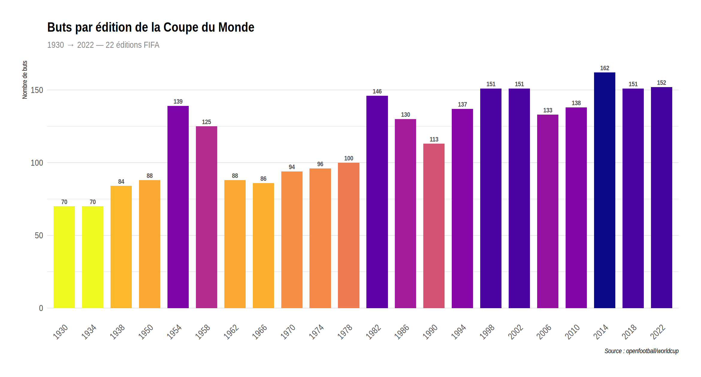
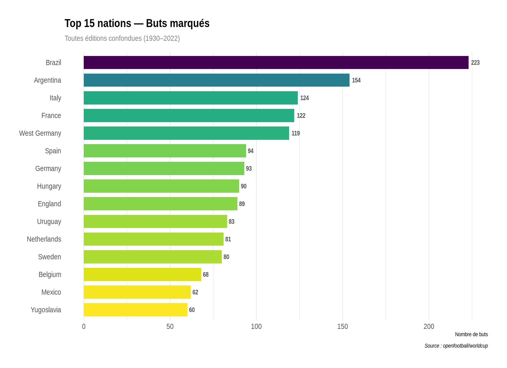
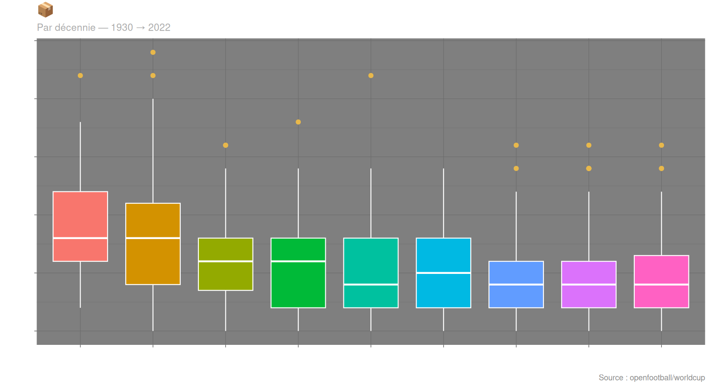
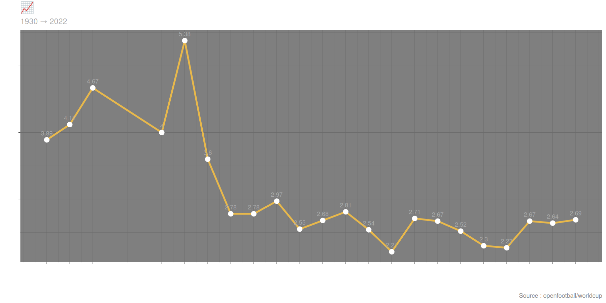
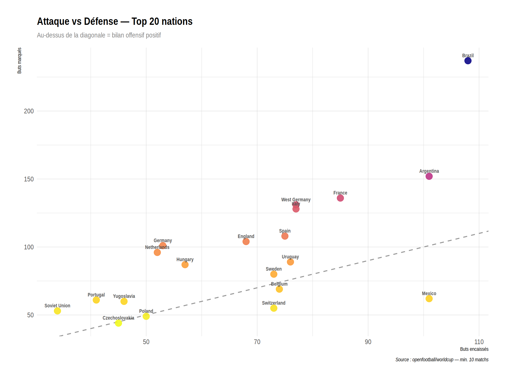

# ⚽ WorldCup Data Platform

> **22 éditions · 964 matchs · 2 604 buts · 85 nations**
> De 1930 à 2022 — chaque match, chaque but, chaque équipe. Construit de zéro.

---

## 📖 À propos

Ce projet est un **pipeline de données complet** sur l'intégralité de l'histoire de la Coupe du Monde FIFA (1930–2022).

Il couvre toute la chaîne Data Engineering : extraction de données brutes, parsing, nettoyage, modélisation relationnelle, API REST, et visualisation statistique — le tout construit **from scratch**.

> Réalisé dans le cadre de la formation **Dev Data P8** à la **Sonatel Académie / Orange Digital Center**, Dakar.

---

## 📊 Ce que le projet couvre

| Étape | Description | Technologie |
|:-----:|-------------|-------------|
| 📥 **Parsing** | Extraction depuis fichiers `.txt` bruts (format openfootball) | Python / Regex |
| 🧹 **Nettoyage** | Normalisation scores, dates, noms d'équipes, gestion `a.e.t.` | Python |
| 🗄️ **Base de données** | Schéma relationnel 9 tables, chargement complet | PostgreSQL |
| 🔌 **API REST** | Endpoints par édition, équipe, match, statistiques | FastAPI |
| 📈 **Visualisation** | 5 graphiques statistiques (histogramme, bar, boxplot, courbe, scatter) | R / ggplot2 |

---

## 📈 Chiffres clés

| Donnée | Volume |
|--------|--------|
| 🏆 **Éditions** | 22 (1930 → 2022) |
| ⚽ **Matchs** | 964 |
| 🎯 **Buts** | 2 604 |
| 👤 **Joueurs** | 6 082 |
| 🤝 **Compositions** | 21 075 |
| 🟨 **Arbitres** | 771 |
| 🏟️ **Stades** | 195 |
| 🌍 **Nations** | 85 |

---

## 🧰 Stack technique

```
┌─────────────────┬─────────────────────────────────────────────┐
│ Python 3.x      │ Parsing, ETL, scripts de chargement         │
│ PostgreSQL      │ Base de données relationnelle (9 tables)    │
│ FastAPI         │ API REST avec documentation Swagger auto     │
│ psycopg2        │ Connecteur Python ↔ PostgreSQL              │
│ R               │ Analyse et visualisation statistique        │
│ ggplot2         │ Graphiques avancés (5 types de visualisation)│
│ hrbrthemes      │ Thèmes typographiques professionnels        │
│ viridis         │ Palettes de couleurs accessibles            │
│ RPostgres / DBI │ Connecteur R ↔ PostgreSQL                   │
└─────────────────┴─────────────────────────────────────────────┘
```

---

## 🗂️ Architecture du projet

```
worldcup-data/
│
├── worldcup/                      # 📁 Données sources (openfootball — ne pas modifier)
│
├── src/                           # 📁 Pipeline ETL + API
│   ├── parser.py                  # Extraction données brutes → JSON
│   ├── load.py                    # Chargement JSON → PostgreSQL
│   ├── utils.py                   # Utilitaires (sauvegarde JSON)
│   ├── main.py                    # Orchestration pipeline complet
│   ├── api.py                     # API REST FastAPI
│   └── schema.sql                 # Schéma base de données
│
├── r/                             # 📁 Visualisations R / ggplot2
│   ├── install.R                  # Installation des packages R
│   ├── connexion.R                # Connexion PostgreSQL
│   ├── viz_01_buts_edition.R      # Histogramme — buts par édition
│   ├── viz_02_buts_equipe.R       # Bar chart — top 15 nations
│   ├── viz_03_distribution.R      # Boxplot — distribution par décennie
│   ├── viz_04_evolution.R         # Courbe — évolution buts/match
│   ├── viz_05_confrontations.R    # Scatter — attaque vs défense
│   ├── dashboard.R                # Script principal
│   └── output/                    # 📊 Graphiques générés (PNG)
│
├── data/
│   └── worldcup_raw.json          # 📄 Données parsées
│
└── README.md
```

---

## 📊 Visualisations

### 1. Buts par édition — Histogramme


---

### 2. Top 15 nations — Bar chart


---

### 3. Distribution des buts/match — Boxplot


---

### 4. Évolution de la moyenne — Courbe


---

### 5. Attaque vs Défense — Scatter plot


---

## 🗃️ Schéma de la base de données

```
                    ┌─────────────┐
                    │  tournois   │
                    └──────┬──────┘
                           │
          ┌────────┐  ┌────┴──────┐  ┌──────────┐
          │ stades ├──►   matchs  ◄──┤  equipes │
          └────────┘  └─────┬─────┘  └──────────┘
                            │
           ┌────────────────┼────────────────┐
           │                │                │
      ┌────┴────┐     ┌──────┴──────┐  ┌─────┴──────────┐
      │  buts   │     │ compositions│  │ matchs_arbitres│
      └────┬────┘     └──────┬──────┘  └────────┬───────┘
           │                 │                   │
      ┌────┴────────────┐    │            ┌──────┴──┐
      │    joueurs      ◄────┘            │arbitres │
      └─────────────────┘                 └─────────┘
```

**9 tables** : `tournois` · `equipes` · `stades` · `matchs` · `joueurs` · `buts` · `compositions` · `arbitres` · `matchs_arbitres`

---

## 🚀 Lancer le projet

### 1. Cloner et installer (Python)

```bash
git clone https://github.com/abdoudjigo/worldcup-data.git
cd worldcup-data
python -m venv venv
source venv/bin/activate
pip install -r requirements.txt
```

### 2. Créer la base PostgreSQL

```bash
psql -U postgres -c "CREATE DATABASE worldcup;"
psql -U postgres -d worldcup -f src/schema.sql
```

### 3. Lancer le pipeline ETL

```bash
python src/main.py
```

### 4. Lancer l'API

```bash
cd src
uvicorn api:app --reload --port 8000
```

> 💡 Documentation Swagger : `http://localhost:8000/docs`

### 5. Installer R et les packages

```bash
# Ubuntu / Debian
sudo apt install r-base libpq-dev -y

# Packages R
Rscript -e "install.packages(c('ggplot2','DBI','RPostgres','jsonlite','dplyr','scales','hrbrthemes','viridis'), repos='https://cloud.r-project.org')"
```

### 6. Générer les visualisations

```bash
Rscript r/dashboard.R
```

> Les graphiques PNG sont générés dans `r/output/`

---

## ✅ Avancement

| Étape | Statut |
|-------|--------|
| Analyse des sources de données (1930–2022) | ✅ Terminé |
| Parser Python — 22 éditions, 964 matchs, 0 erreur | ✅ Terminé |
| Nettoyage et normalisation des données | ✅ Terminé |
| Schéma PostgreSQL — 9 tables relationnelles | ✅ Terminé |
| Chargement complet en base | ✅ Terminé |
| API REST FastAPI — tournois, équipes, matchs, stats | ✅ Terminé |
| Visualisations R / ggplot2 — 5 graphiques | ✅ Terminé |
| Déploiement | 📅 Planifié |

---

## 📦 Source des données

[openfootball/worldcup](https://github.com/openfootball/worldcup) — données open source au format texte brut, couvrant 22 éditions de la Coupe du Monde FIFA de 1930 à 2022.

---

## 👤 Auteur

**Abdoulaye Djigo**
Étudiant Dev Data — Sonatel Académie / Orange Digital Center, Dakar, Sénégal

[](https://github.com/abdoudjigo)

---

## 📄 Licence

Ce projet est à usage éducatif dans le cadre de la formation Dev Data P8.

---

<div align="center">
  <sub>Construit avec ❤️ · Python 🐍 · R 📊 · PostgreSQL 🐘 · à Dakar</sub>
</div>